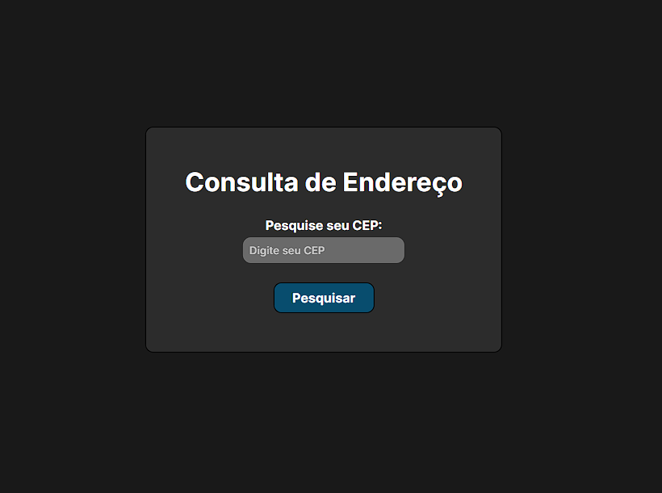

<h1>Consultador de Endereço</h1>

Projeto feito para testar minhas habilidades no <b style='color: cyan'>React</b>, utilizando dados de uma <b style='color: orange'>API</b> e usando <b style='color: purple'>Axios</b> para fazer requisições. 

Alimentei este projeto com uma <b style='color: orange'>API de endereços <a href='https://viacep.com.br/' style='color: white'>(ViaCEP)</a></b> para, então, a busca ser feita e mostrada a baixo do formulário após o preenchimento do <b style='color: green'>CEP</b>.

