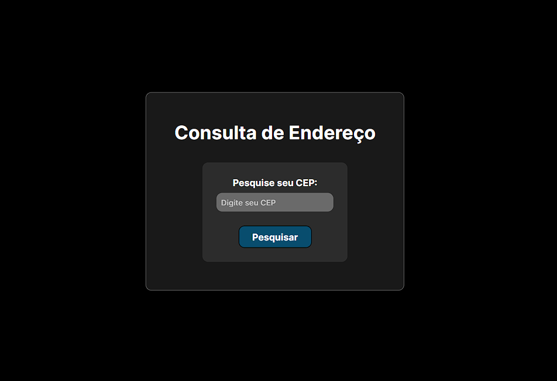

<h1>Consultador de Endereço</h1>

## Tecnologias
Esse projeto foi desenvolvido com as seguintes tecnologias:
- Git e GitHub
- HTML e CSS
- React e Typescript

## Projeto

Projeto feito para testar minhas habilidades no <b style='color: cyan'>React</b>, utilizando dados de uma <b style='color: orange'>API</b> e usando <b style='color: purple'>Axios</b> para fazer requisições. 

Alimentei este projeto com uma <b style='color: orange'>API de endereços</b> [(ViaCEP)](https://viacep.com.br/) para, então, buscar o endereço, após o preenchimento do <b style='color: green'>CEP</b>, e mostrá-lo a baixo do formulário.

---
Project by Thyago Thayllan.